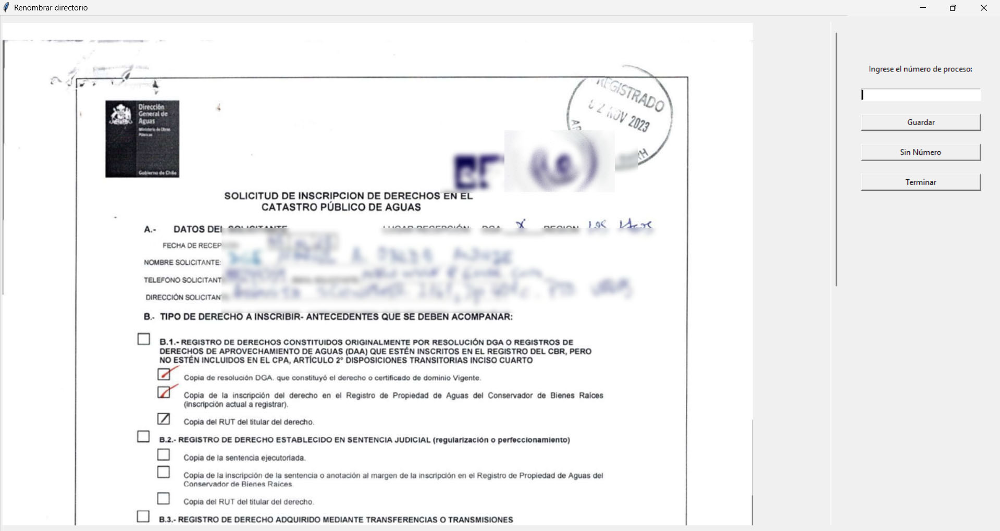

### Interfaz para organizar directorios CBR

Este proyecto facilita la organización de directorios que contienen documentos relacionados con derechos de aprovechamiento de agua. A través de una interfaz gráfica de usuario (GUI), su objetivo principal es renombrar subdirectorios siguiendo un formato específico basado en ciertos parámetros de entrada.

En un escenario ideal, los subdirectorios ya existen y contienen un archivo llamado `SOL.pdf`, que tiene 2 páginas, con un número de proceso entre ellas. Este número se extrae manualmente y se usa para identificar y renombrar el subdirectorio.

En otros casos, si los subdirectorios no existen, la carpeta principal contiene archivos PDF completos que aún no han sido procesados. En este caso, cada archivo PDF se debe mover a un nuevo subdirectorio y crear un archivo `SOL.pdf` a partir de sus primeras 2 páginas, antes de proceder con el renombramiento



## Requerimientos

Es necesario instalar todas las dependencias necesarias antes de ejecutar este proyecto. La instalación se puede realizar con el siguiente comando:

```bash
pip install -r requirements.txt
```

### Dependencias principales

- `pdf2image`
- `Pillow`
- `PyPDF2`
- `tkinter` (incluido por defecto en la mayoría de las instalaciones de Python)

## Uso

1. Crea una carpeta que contenga documentos pdf no recortados o una carpeta que contenga subdirectorios que tengan en su interior los documentos ya recortados (debe incluir el archivo `SOL.pdf`.
2. Ejecuta el script principal `main.py`.

   ```python
   python main.py
   ````
3. Escoge una opción del menu principal y completa los campos solicitados.

### Flujo de procesamiento

* Escoge una `opción` del menú principal:

  (Antes de comenzar cualquier proceso, el programa buscará en la ruta ingresada, documentos pdf que no han sido procesados aún, de manera automática, moviendolo a una carpeta con su mismo nombre y creando el archivo `SOL.pdf`. Además, se creará un archivo `Control de cambios.csv`, con los encabezados `Nombre anterior`, `Nombre nuevo`, `Fecha`, si este no existe)

  - `Renombrar subdirectorios`:
    - Esta opción solicita el directorio principal, el nombre del CBR y número de entrega. mencionados en el codigo como `directory`, `CBR` y `submission_number` respectivamente.
    - Luego buscará las rutas de cada archivo `SOL.pdf`, y por cada resultado se abrirá una ventana a la vez, que solicita el número de proceso del documento, mencionado en el código como `process_number`.
    - Si `se ingresa un número de proceso`, el subdirectorio que contiene el archivo será renombrado como `<submission_number>_<CBR>_<process_number>`.
    - Si `el número de proceso está repetido` el nombre será `REP1_<submission_number>_<CBR>_<process_number>`, `REP2_<submission_number>_<CBR>_<process_number>`, etc., dependiendo del número de veces que se repita el nombre.
    - Si no se ingresa un número de proceso, el nombre será `<submission_number>_<CBR>_SN1`, `<submission_number>_<CBR>_SN2`, etc., dependiendo de la cantidad de solicitudes sin número.
    - Cada cambio de nombre de los subdirectorios será **añadido** en una nueva linea en el archivo `Control de cambios.csv`
  - `Solo crear "Control de cambios.csv"`:
    - Esta opción solo solicita el directorio principal, asumiendo que los subdirectorios ya están nombrados de manera correcta, **añadiendo** al archivo `Control de cambios.csv` una nueva linea que contiene solo el nombre del subdirectorio en la columna correspondiente a `Nombre nuevo`.

### Entradas

Las entradas solicitadas por el programa son las siguientes:

`````python
# Ruta del directorio principal que contiene los subdirectorios o documentos
directory = r"C:\example\main path"

# String numérico que hace mención a la entrega correspondiente a la solicitud
submission_number = "1"

# String que hace mención a la comúna que corresponde el documento CBR
CBR = "COMUNA"

# String numérico que hace mención al numero de proceso de la solicitud CBR
process_number = "1234"
`````


### Salidas

Los cambios serán almacenados en un archivo `control de cambios.csv` que se almacenará en el directorio principal, donde se registrará en cada fila del este el nombre antiguo del directorio, el nuevo nombre y una marca datetime.


### Manejo de errores

El script está diseñado para continuar ejecutándose aunque ocurran errores en el proceso. Si un archivo PDF falla al procesar, el programa lo saltará y continuará con los demás archivos. Además, evita errores causados por nombres de directorios duplicados, añadiendo el prefijo REP1_, REP2_, REP3_, etc. a los directorios repetidos con el mismo número de proceso. Si no se ingresa un número de proceso, el programa añadirá el sufijo _SN1, _SN2, _SN3, etc. a los directorios sin número de proceso, evitando conflictos por duplicación de nombres.
